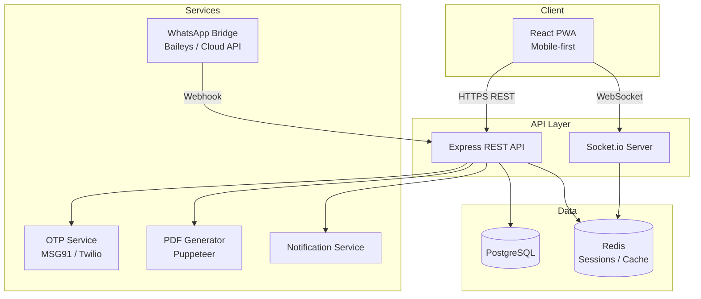
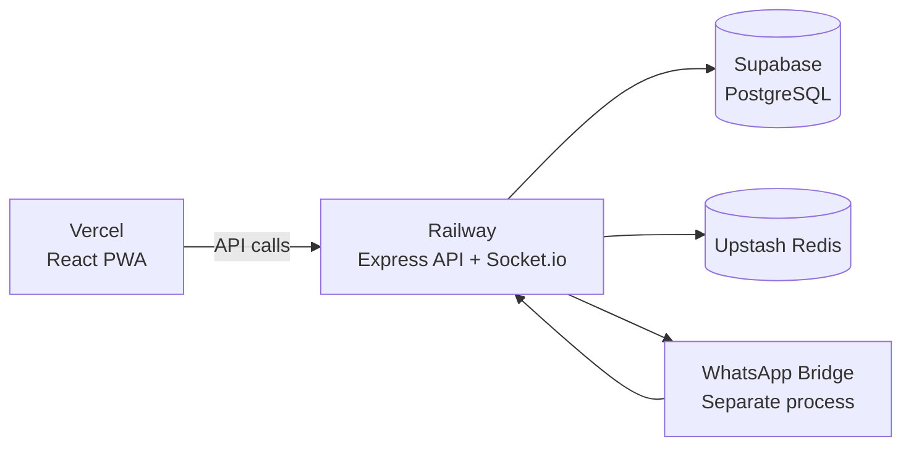
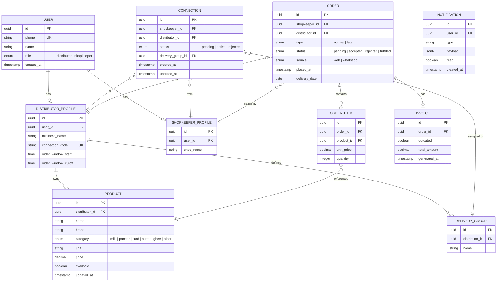

# Design Document: DairySetu

## Overview

DairySetu is a mobile-first B2B ordering platform for dairy distributors and shopkeepers. It replaces ad-hoc WhatsApp order management with a structured, real-time system that handles order placement, demand aggregation, billing, and a WhatsApp Bridge for shopkeepers who prefer messaging.

The product has two distinct user personas with very different needs:

- **Shopkeeper**: Places orders fast, on a phone, often in under 30 seconds. Needs a clean catalog view, minimal taps, and clear confirmation.
- **Distributor**: Manages the day — approves connections, monitors orders, reviews demand summaries, generates invoices. Needs a dashboard that surfaces the right information without noise.

### Design Principles

- Mobile-first, touch-optimized UI throughout
- Fast order placement: catalog → quantities → confirm in 3 steps
- Role-based views with strict permission separation
- Real-time updates (order counts, summaries) without page refresh
- WhatsApp Bridge as a first-class integration, not an afterthought
- OTP authentication — no passwords to remember

---

## Architecture

DairySetu uses a standard three-tier web architecture with a React frontend, a Node.js/Express REST API backend, and a PostgreSQL database. Real-time updates are delivered via WebSockets (Socket.io). The WhatsApp Bridge runs as a separate service that communicates with the core API.



### Tech Stack

| Layer | Choice | Rationale |
|---|---|---|
| Frontend | React + Vite + TypeScript | Fast builds, strong typing, large ecosystem |
| UI Library | shadcn/ui + Tailwind CSS | Modern, accessible components; easy mobile customization |
| State Management | Zustand + React Query | Lightweight global state; server state caching |
| Backend | Node.js + Express + TypeScript | Familiar JS stack; easy WhatsApp library integration |
| Database | PostgreSQL | Relational data fits the domain well; strong JSON support |
| ORM | Prisma | Type-safe queries; easy migrations |
| Real-time | Socket.io | Reliable WebSocket with fallback; works on mobile networks |
| Auth | OTP via SMS (MSG91) + JWT | No passwords; phone-verified identity |
| WhatsApp | Baileys (self-hosted) or WhatsApp Cloud API | Message parsing and reply |
| PDF | Puppeteer (headless Chrome) | High-fidelity invoice rendering |
| Cache / Sessions | Redis | JWT refresh tokens; notification batching |
| Hosting | Railway / Render (backend) + Vercel (frontend) | Low-ops, affordable for small-scale B2B |

### Deployment Architecture



---

## Components and Interfaces

### Frontend Component Tree

```
App
├── AuthGuard (redirects unauthenticated users)
├── Auth
│   ├── PhoneEntry
│   ├── OTPVerification
│   └── RoleSelection (first-time only)
│
├── Shopkeeper Layout
│   ├── CatalogPage
│   │   ├── ProductGrid / ProductList
│   │   ├── ProductCard (name, brand, unit, price, qty control)
│   │   └── OrderWindowBanner (shows cutoff time + late warning)
│   ├── OrderReviewPage (summary before submit)
│   ├── OrderHistoryPage
│   └── ConnectionPage (connect to distributor)
│
└── Distributor Layout
    ├── DashboardPage
    │   ├── OrderCountBadges (Normal | Late)
    │   ├── NormalOrdersList
    │   ├── LateOrdersList (with Accept/Reject actions)
    │   └── DeliveryGroupTabs
    ├── OrderSummaryPage
    │   ├── SummaryTable (product × brand × total qty)
    │   └── DeliveryGroupBreakdown
    ├── CatalogManagementPage
    │   ├── ProductForm (add/edit)
    │   └── ProductTable
    ├── ConnectionsPage
    │   ├── PendingConnectionsList (Approve/Reject)
    │   └── ActiveConnectionsList (assign delivery group)
    ├── InvoicePage
    │   ├── InvoicePreview
    │   └── ExportActions (PDF, WhatsApp share)
    └── SettingsPage
        └── OrderWindowConfig
```

### API Endpoints

#### Authentication
```
POST /api/auth/otp/send        — send OTP to phone number
POST /api/auth/otp/verify      — verify OTP, return JWT
POST /api/auth/register        — complete profile (name, role)
POST /api/auth/refresh         — refresh JWT
```

#### Connections
```
POST   /api/connections                    — shopkeeper requests connection
GET    /api/connections                    — list connections (role-filtered)
PATCH  /api/connections/:id/approve        — distributor approves
PATCH  /api/connections/:id/reject         — distributor rejects
PATCH  /api/connections/:id/delivery-group — assign delivery group
```

#### Catalog
```
GET    /api/catalog                        — shopkeeper: get connected distributor's catalog
GET    /api/distributor/catalog            — distributor: get own catalog
POST   /api/distributor/catalog            — add product
PATCH  /api/distributor/catalog/:id        — update product
DELETE /api/distributor/catalog/:id        — remove product
```

#### Orders
```
POST   /api/orders                         — shopkeeper: place order
GET    /api/orders                         — shopkeeper: order history
GET    /api/distributor/orders             — distributor: all orders (filterable)
GET    /api/distributor/orders/:id         — order detail
PATCH  /api/distributor/orders/:id/accept  — accept late order
PATCH  /api/distributor/orders/:id/reject  — reject late order
```

#### Order Summary
```
GET    /api/distributor/summary            — aggregated demand summary
GET    /api/distributor/summary/group/:id  — per delivery group summary
```

#### Invoices
```
GET    /api/distributor/invoices/:orderId  — get invoice
POST   /api/distributor/invoices/:orderId/regenerate
GET    /api/distributor/invoices/:orderId/pdf  — download PDF
```

#### Settings
```
GET    /api/distributor/settings           — get order window config
PATCH  /api/distributor/settings           — update order window
```

#### WhatsApp Bridge (internal webhook)
```
POST   /api/webhook/whatsapp               — incoming message from WA bridge
```

### WebSocket Events

| Event | Direction | Payload |
|---|---|---|
| `order:new` | Server → Distributor | `{ orderId, shopkeeperName, type }` |
| `order:late_decision` | Server → Shopkeeper | `{ orderId, status: 'accepted' \| 'rejected' }` |
| `connection:approved` | Server → Shopkeeper | `{ distributorName }` |
| `connection:rejected` | Server → Shopkeeper | `{}` |
| `summary:updated` | Server → Distributor | `{ productId, newTotal }` |

---

## Data Models

### Entity Relationship Diagram



### Key Design Decisions

**Snapshot pricing in ORDER_ITEM**: `unit_price` is stored on the order item at placement time, not referenced from the product. This ensures invoices remain accurate even if the distributor later changes prices.

**`delivery_date` on ORDER**: Derived from the order timestamp and the distributor's order window. Orders placed before cutoff get tomorrow's date; late orders get the same date but require approval.

**`source` on ORDER**: Distinguishes web-placed orders from WhatsApp Bridge orders for analytics and debugging.

**`connection_code` on DISTRIBUTOR_PROFILE**: A short, human-readable alphanumeric code (e.g., `AMUL-7X3`) that distributors can share verbally or on a card.

**Single active connection per shopkeeper**: Enforced at the database level with a partial unique index on `(shopkeeper_id, status)` where `status = 'active'`.


---

## Correctness Properties

*A property is a characteristic or behavior that should hold true across all valid executions of a system — essentially, a formal statement about what the system should do. Properties serve as the bridge between human-readable specifications and machine-verifiable correctness guarantees.*

### Property 1: Connection request creates pending state

*For any* registered shopkeeper and any valid distributor phone number or connection code, submitting a connection request should result in a connection record with status `pending` associated with that shopkeeper and distributor.

**Validates: Requirements 1.1**

---

### Property 2: Connection state transitions are correct

*For any* pending connection, approving it should transition its status to `active`, and rejecting it should transition its status to `rejected`. No other status transitions are valid from `pending`.

**Validates: Requirements 1.2, 1.3**

---

### Property 3: Non-active connection blocks catalog access

*For any* shopkeeper whose connection is in `pending` or `rejected` status (or who has no connection), a request to the catalog endpoint should return an authorization error.

**Validates: Requirements 1.4**

---

### Property 4: Active connection filters catalog to connected distributor only

*For any* shopkeeper with an active connection to distributor D, the catalog returned should contain only available products belonging to distributor D and no products from any other distributor.

**Validates: Requirements 1.5**

---

### Property 5: Invalid connection code returns error

*For any* phone number or connection code that does not match a registered distributor, the connection request should fail with a descriptive error and no connection record should be created.

**Validates: Requirements 1.6**

---

### Property 6: At most one active connection per shopkeeper

*For any* shopkeeper who already has an active connection, attempting to create another active connection should be rejected, leaving the existing connection unchanged.

**Validates: Requirements 1.7**

---

### Property 7: Catalog CRUD round trip

*For any* product added to a distributor's catalog, that product should be retrievable from the catalog with all fields intact. After editing, the updated fields should be reflected. After deletion, the product should no longer appear.

**Validates: Requirements 2.1**

---

### Property 8: Unavailable products excluded from shopkeeper catalog

*For any* product marked as `available = false`, it should not appear in the catalog returned to any connected shopkeeper, regardless of the shopkeeper's identity.

**Validates: Requirements 2.3**

---

### Property 9: Order classification matches cutoff time

*For any* order placed at timestamp T and any distributor with cutoff time C, if T is before C then the order type should be `normal`; if T is at or after C then the order type should be `late`. This applies equally to web-placed and WhatsApp Bridge orders.

**Validates: Requirements 3.4, 3.5, 4.2, 9.2**

---

### Property 10: Order record completeness

*For any* submitted order, the stored record should contain: the shopkeeper's identity, the distributor's identity, a placement timestamp, a delivery date, the order type, and at least one order item with a product reference, quantity, and snapshot unit price.

**Validates: Requirements 3.3**

---

### Property 11: Zero-item order rejected

*For any* order submission containing no items (or only items with quantity zero), the system should reject the submission and no order record should be created.

**Validates: Requirements 3.6**

---

### Property 12: Order window settings persist and are retrievable

*For any* distributor who sets an order window start time and cutoff time, a subsequent read of their settings should return the same values.

**Validates: Requirements 4.1**

---

### Property 13: Late order accept/reject changes status correctly

*For any* late order, accepting it should set its status to `accepted` and rejecting it should set its status to `rejected`. After either action, the order should no longer appear in the pending late orders list.

**Validates: Requirements 5.2**

---

### Property 14: Order summary aggregation is correct

*For any* set of accepted orders (normal and late) for a given delivery date, the Order_Summary total quantity for each product should equal the arithmetic sum of that product's quantities across all accepted orders for that date.

**Validates: Requirements 6.1, 5.3, 6.3**

---

### Property 15: Order summary grouped by brand and category

*For any* Order_Summary, every entry should carry both a brand and a category field, and entries with the same brand and category should be grouped together.

**Validates: Requirements 6.2**

---

### Property 16: Per-delivery-group summary is correct

*For any* delivery group G, the per-group summary total for each product should equal the sum of that product's quantities across all accepted orders from shopkeepers assigned to group G.

**Validates: Requirements 7.3**

---

### Property 17: Invoice contains all required fields

*For any* accepted order, the generated invoice should contain: shopkeeper name, order date, an itemized list of products with quantities and unit prices (snapshotted at order time), and a total amount equal to the sum of (quantity × unit_price) for all items.

**Validates: Requirements 8.1**

---

### Property 18: Order modification marks invoice outdated

*For any* order that has an associated invoice, modifying the order should set the invoice's `outdated` flag to `true`.

**Validates: Requirements 8.4**

---

### Property 19: WhatsApp message parsing round trip

*For any* WhatsApp message that contains recognizable product names and quantities, parsing it should produce an order whose items match the products and quantities present in the message text.

**Validates: Requirements 9.1**

---

### Property 20: Unknown WhatsApp sender triggers registration reply

*For any* incoming WhatsApp message from a phone number not associated with any registered shopkeeper, the system should send exactly one automated reply containing registration instructions and no order should be created.

**Validates: Requirements 9.6**

---

### Property 21: Unparseable WhatsApp message triggers format-hint reply

*For any* WhatsApp message from a registered shopkeeper that cannot be parsed into a valid order, the system should send exactly one automated reply with a format example and no order should be created.

**Validates: Requirements 9.3**

---

### Property 22: Notification count invariant

*For any* single order event (normal order placed, late order received, late order decision made), exactly one notification should be delivered to the relevant recipient — not one per product line and not zero.

**Validates: Requirements 10.1, 10.2, 10.4**

---

### Property 23: Notification batching within 5-minute window

*For any* set of N order notifications for the same distributor that all arrive within a 5-minute window, the distributor should receive exactly one batched notification (not N separate ones).

**Validates: Requirements 10.3**

---

### Property 24: Unauthenticated requests rejected

*For any* API endpoint that requires authentication, a request without a valid JWT should receive a 401 response and no data should be returned.

**Validates: Requirements 11.1, 11.4**

---

### Property 25: Role-based access control

*For any* API endpoint designated for distributors only, a request authenticated as a shopkeeper should receive a 403 response, and vice versa.

**Validates: Requirements 11.3**

---

## Error Handling

### Authentication Errors
- Invalid or expired OTP → `400 Bad Request` with message "Invalid or expired OTP"
- Expired JWT → `401 Unauthorized`; client should attempt token refresh
- Missing JWT → `401 Unauthorized` with redirect hint to login

### Connection Errors
- Invalid distributor phone/code → `404 Not Found` with message "No distributor found with that phone number or code"
- Duplicate active connection attempt → `409 Conflict` with message "You already have an active connection"
- Accessing catalog without active connection → `403 Forbidden`

### Order Errors
- Empty order submission → `400 Bad Request` with message "Order must contain at least one item"
- Order placed by shopkeeper with no active connection → `403 Forbidden`
- Product in order not in distributor's catalog → `422 Unprocessable Entity` with the offending product IDs listed

### WhatsApp Bridge Errors
- Message from unregistered number → automated WhatsApp reply, no HTTP error (webhook returns 200 to avoid retries)
- Unparseable message → automated WhatsApp reply with format hint, webhook returns 200
- WhatsApp API unavailable → log error, queue retry with exponential backoff (max 3 attempts)

### Invoice Errors
- PDF generation failure → `500 Internal Server Error`; log for retry; do not expose stack trace to client
- Invoice requested for non-existent order → `404 Not Found`

### General Principles
- All errors return JSON: `{ "error": { "code": "...", "message": "..." } }`
- 5xx errors are logged with full context (request ID, user ID, timestamp) but return generic messages to clients
- Validation errors (400/422) include field-level detail to help the client display inline messages
- Rate limiting on OTP send endpoint: max 3 OTP requests per phone number per 10 minutes

---

## Testing Strategy

### Dual Testing Approach

Both unit tests and property-based tests are required. They are complementary:

- **Unit tests** catch concrete bugs in specific scenarios, edge cases, and integration points
- **Property-based tests** verify universal correctness across the full input space

### Unit Testing

Framework: **Vitest** (frontend and backend, unified toolchain)

Focus areas:
- OTP flow: send → verify → JWT issuance
- Order classification logic (before/after cutoff)
- Invoice total calculation
- WhatsApp message parser with specific message examples
- Notification batching logic with time-boundary examples
- API integration tests for each endpoint (using Supertest)
- React component rendering tests for key UI states (Shopkeeper catalog, Distributor dashboard)

Avoid writing unit tests for every permutation of inputs — that's what property tests are for.

### Property-Based Testing

Framework: **fast-check** (TypeScript-native, works in Vitest)

Configuration: minimum **100 iterations** per property test.

Each property test must reference its design document property using this tag format in a comment:
`// Feature: dairy-setu, Property {N}: {property_text}`

| Property | Test Description | Pattern |
|---|---|---|
| P1 | Connection request creates pending state | Invariant |
| P2 | Connection state transitions | State machine |
| P3 | Non-active connection blocks catalog | Access control |
| P4 | Active connection filters catalog | Filtering |
| P5 | Invalid code returns error | Error condition |
| P6 | One active connection per shopkeeper | Invariant |
| P7 | Catalog CRUD round trip | Round trip |
| P8 | Unavailable products excluded | Filtering |
| P9 | Order classification matches cutoff | Metamorphic |
| P10 | Order record completeness | Invariant |
| P11 | Zero-item order rejected | Error condition |
| P12 | Order window settings persist | Round trip |
| P13 | Late order accept/reject | State machine |
| P14 | Summary aggregation is correct | Model-based |
| P15 | Summary grouped by brand/category | Invariant |
| P16 | Per-delivery-group summary | Model-based |
| P17 | Invoice field completeness | Invariant |
| P18 | Order modification marks invoice outdated | State machine |
| P19 | WhatsApp parsing round trip | Round trip |
| P20 | Unknown sender triggers reply | Error condition |
| P21 | Unparseable message triggers reply | Error condition |
| P22 | Notification count invariant | Invariant |
| P23 | Notification batching | Metamorphic |
| P24 | Unauthenticated requests rejected | Access control |
| P25 | Role-based access control | Access control |

### UI/UX Testing

- **Playwright** for end-to-end flows: shopkeeper order placement, distributor late order approval, invoice PDF download
- Mobile viewport testing (375px width) for all critical flows
- Accessibility: axe-core integration in Playwright for WCAG 2.1 AA compliance checks

### WhatsApp Bridge Testing

- Unit tests for the message parser with a corpus of realistic message formats (Hindi/English mix, abbreviations, common typos)
- Mock the WhatsApp API in integration tests to verify reply content without sending real messages
